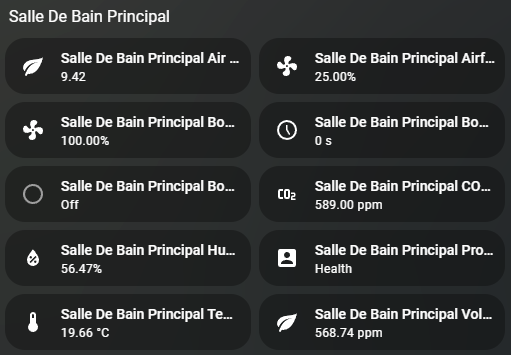
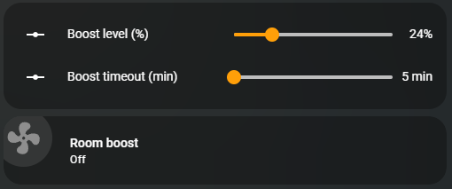
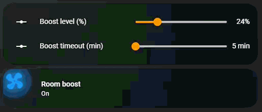

# Dashboard Setup Guide

This guide shows how to create a dashboard with controls for Healthbox room boost functionality.

## Media Files

Current media used in this guide:




## Step 1: Create Two Slider Helpers

Go to **Settings → Devices & services → Helpers → Create helper → Number**

### Create Boost Level Helper
- **Entity ID**: `input_number.sdb_boost_level`
- **Min**: 1
- **Max**: 100
- **Step**: 1
- **Unit of measurement**: %
- **Mode**: Slider

### Create Boost Timeout Helper
- **Entity ID**: `input_number.sdb_boost_timeout`
- **Min**: 5
- **Max**: 720
- **Step**: 5 (or 1)
- **Unit of measurement**: min
- **Mode**: Slider

## Step 2: Create a Script

Go to **Settings → Automations & scenes → Scripts → Create script**

Choose **Edit in YAML** and paste the following:

```yaml
alias: Start SDB room boost
mode: single
sequence:
  - action: healthbox.start_room_boost
    data:
      device_id: "dcd20c575972a426358c4c8fdd504b20"
      boost_level: "{{ states('input_number.sdb_boost_level') | int(0) }}"
      boost_timeout: "{{ states('input_number.sdb_boost_timeout') | int(0) }}"
```

**Important**: Replace `device_id` with the actual device ID of your Healthbox room.

Save the script (it will be assigned an entity ID like `script.start_sdb_room_boost`).

## Step 3: Add Controls to Dashboard

Go to your dashboard and add an **Entities** card with:


```yaml
type: entities
entities:
  - entity: input_number.sdb_boost_level
    name: Boost level (%)
  - entity: input_number.sdb_boost_timeout
    name: Boost timeout (min)
  - type: button
    name: Start boost
    tap_action:
      action: call-service
      service: script.start_sdb_room_boost
```

## Step 4: Test

1. Move the two sliders to your desired values
2. Press **Start boost** button
3. The script reads the slider values and calls `healthbox.start_room_boost` with:
   - `boost_level` = 1–100 (%)
   - `boost_timeout` = 5–720 (minutes)

Add this as an extra step at the end of your guide to get the **animated fan icon button** while keeping the sliders.

## Step 5 — Add an animated Mushroom “fan” button (spins when boost is running)
1) Make sure you already have:
- `script.start_sdb_room_boost` (your working script)
- `binary_sensor.salle_de_bain_principal_boost_status` (shows `on/off`)


2) Add this card to your dashboard (it keeps the sliders and adds an animated Mushroom button):

```yaml name=boost_controls_with_animated_mushroom_button.yaml
type: vertical-stack
cards:
  - type: entities
    entities:
      - entity: input_number.sdb_boost_level
        name: Boost level (%)
      - entity: input_number.sdb_boost_timeout
        name: Boost timeout (min)

  - type: custom:mushroom-template-card
    primary: Room boost
    secondary: >
      {{ 'Running' if is_state('binary_sensor.salle_de_bain_principal_boost_status','on') else 'Stopped' }}
    icon: mdi:fan
    icon_color: >
      {{ 'blue' if is_state('binary_sensor.salle_de_bain_principal_boost_status','on') else 'disabled' }}
    tap_action:
      action: call-service
      service: script.start_sdb_room_boost
    hold_action:
      action: more-info
      entity: binary_sensor.salle_de_bain_principal_boost_status
    card_mod:
      style: |
        mushroom-shape-icon$:
          .shape {
            
              animation: fan-spin 0.8s linear infinite;
            
            transform-origin: 50% 50%;
          }
        @keyframes fan-spin {
          0%   { transform: rotate(0deg); }
          100% { transform: rotate(360deg); }
        }
```

This keeps your “set % + minutes with sliders” workflow, and gives you a clear visual indicator (spinning fan) whenever the boost status sensor is `on`.

## Step 5 (Alternative) — Animated “running fan” button (HA-Animated-cards style)

This is an alternative to the simple spinning icon. It uses the same **card_mod + Mushroom** animation style popularized in **@Anashost/HA-Animated-cards** (fan “turbine” spin + glow), and it animates only when your boost status is running (`on`).  

Add this **below your sliders** (keep Steps 1–4 the same).

```yaml name=boost_controls_with_animated_entity_card.yaml
type: vertical-stack
cards:
  - type: entities
    entities:
      - entity: input_number.sdb_boost_level
        name: Boost level (%)
      - entity: input_number.sdb_boost_timeout
        name: Boost timeout (min)

  - type: custom:mushroom-entity-card
    entity: binary_sensor.salle_de_bain_principal_boost_status
    name: Room boost
    icon: mdi:fan
    icon_color: blue
    primary_info: name
    secondary_info: state
    tap_action:
      action: call-service
      service: script.start_sdb_room_boost
    hold_action:
      action: more-info
    card_mod:
      style:
        mushroom-shape-icon$: |
          .shape {
            {# ========== CONFIG (adapted) ========== #}
            
            
            

            {# Use your boost level helper (1..100) to choose spin speed #}
            
            {# ====================================== #}

            
              
                --shape-animation: fan-turbine 0.5s linear infinite;
                opacity: 1;
              
                --shape-animation: fan-turbine 0.8s linear infinite;
                opacity: 1;
              
                --shape-animation: fan-turbine 1.2s linear infinite;
                opacity: 1;
              
                --shape-animation: fan-rock 2.4s ease-in-out infinite;
                opacity: 0.7;
              
            
              --shape-animation: none;
              opacity: 0.7;
            

            transform-origin: 50% 50%;
            position: relative;
            box-shadow:
              0 0 0 0 rgba(var(--rgb-{{ config.icon_color }}), 0.6),
              0 0 0 6px rgba(var(--rgb-{{ config.icon_color }}), 0.08),
              0 0 18px 0 rgba(var(--rgb-{{ config.icon_color }}), 0.7);
          }

          @keyframes fan-turbine {
            0% {
              transform: rotate(0deg) scale(1);
              filter: drop-shadow(0 0 3px rgba(var(--rgb-{{ config.icon_color }}), 0.9));
            }
            25% { transform: rotate(90deg) scale(1.02); }
            50% {
              transform: rotate(180deg) scale(1.04);
              filter: drop-shadow(0 0 8px rgba(var(--rgb-{{ config.icon_color }}), 1));
            }
            75% { transform: rotate(270deg) scale(1.02); }
            100% {
              transform: rotate(360deg) scale(1);
              filter: drop-shadow(0 0 3px rgba(var(--rgb-{{ config.icon_color }}), 0.9));
            }
          }

          @keyframes fan-rock {
            0%   { transform: rotate(-4deg); }
            50%  { transform: rotate(4deg); }
            100% { transform: rotate(-4deg); }
          }
        .: |
          mushroom-shape-icon {
            --icon-size: 65px;
            display: flex;
            margin: -18px 0 10px -20px !important;
            padding-right: 10px;
          }
          ha-card {
            clip-path: inset(0 0 0 0 round var(--ha-card-border-radius, 12px));
          }
```

**What it does**
- Spins/glows the fan icon only when `binary_sensor.salle_de_bain_principal_boost_status` is `on`
- Uses `input_number.sdb_boost_level` to pick a faster/slower animation rate
- Tap runs your working script: `script.start_sdb_room_boost`

If you want, I can also add an optional “Stop boost” action (if Healthbox exposes one) and switch the card to a two-button layout (Start/Stop) in the same HA-Animated-cards style.

## Troubleshooting

**Script entity ID mismatch**: If your script entity ID is not exactly `script.start_sdb_room_boost`, replace the `service` line in the dashboard button with your script's actual entity ID shown in the script editor.

**Device ID not found**: Make sure to replace the example `device_id` in the script with the actual device ID of your Healthbox room. You can find this in the device settings.
